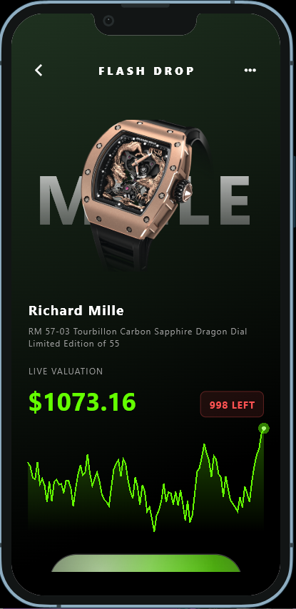
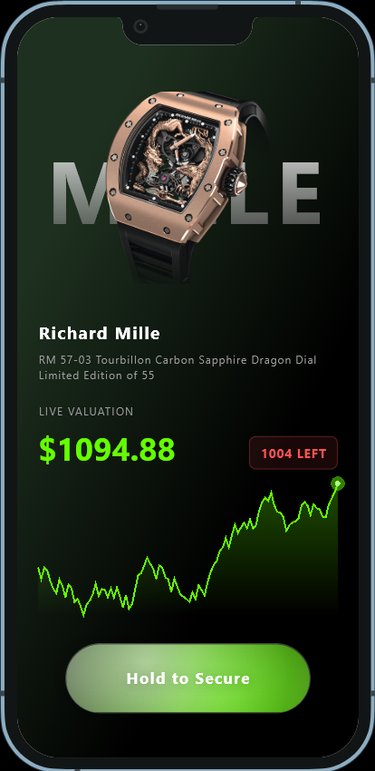

# Quickeee Task 🚀

A modern Flutter application with clean UI, smooth animations, and scalable architecture.

---

## ✨ Features
- 🎯 Clean Architecture (Scalable & Maintainable)
- ⚡ Smooth Animations & UI
- 🔄 State Management (Bloc)
- 📱 Responsive Design
- 🎨 Modern UI inspired by design platforms

---

## 📸 Screenshots





---

## 🎨 Design References

This app UI is inspired by designs from:

- 🌐 Dribbble: https://dribbble.com/
- 📌 Pinterest: https://www.pinterest.com/

---

## 🖼️ Assets Credits

- PNG Images from: https://www.pngegg.com/

---

## 🚀 Getting Started

### Prerequisites
- Flutter SDK
- Android Studio / VS Code

### Run Project

```bash
cd quickeee_task
flutter pub get
flutter run
